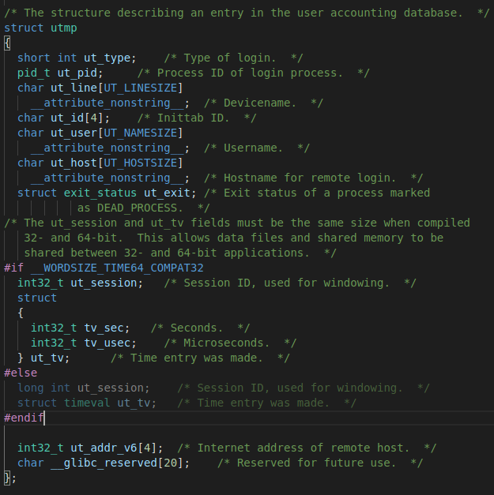
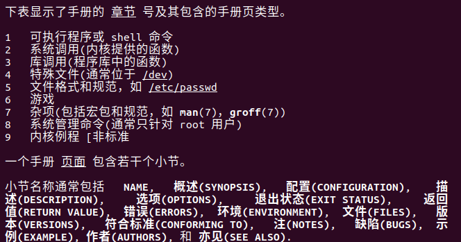
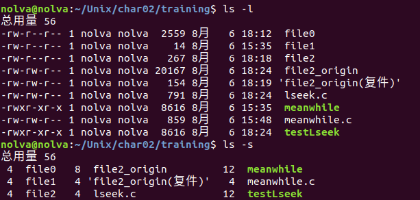

# [用户、文件操作与联机帮助]

####  - 2.1


`who`展示了用户名、终端名、登录时间以及*登录地址(默认不显示)*.

`w`第一行展示了**当前时间、系统运行时间、有多少登录用户以及过去1、5和15分钟的系统负载平均值**；后续的列表展示了：用户名、终端名、**远程主机名(remote host)**、登录时间、**空置时间(idle time)、JCPU、PCPU以及当前进程的命令行**.

其中 JCPU 是由连接到 TTY 所有进程使用的时间。它不包括过去的后台任务，但包括当前正在运行的后台任务。PCPU 是 what 字段表示的进程使用的时间。这些信息来自于 `/var/run/utmp` 和 `/proc`。

`man 5 proc`可知道`/proc`的信息，`/proc`目录是一种文件系统，即proc文件系统。与其它常见的文件系统不同的是，`/proc`是一种伪文件系统（也即虚拟文件系统），存储的是当前内核运行状态的一系列特殊文件，用户可以通过这些文件**查看有关系统硬件及当前正在运行进程的信息**，甚至可以通过更改其中某些文件来改变内核的运行状态。



分析`utmp.h`中的utmp结构体，包含了用户名、终端名、登录时间、remote host的信息。其他均来自`/proc`.


####  - 2.2

查阅了一下 man,描述如下：Furthermore, the terminal name ~ with username shutdown or reboot indicates a system shutdown or reboot and the pair of terminal names |/} logs the old/new system time when date(1) changes it. wtmp is maintained by login(1), init(1), and some versions of getty(8) (e.g., mingetty(8) or agetty(8)). None of these programs creates the file, so if it is removed, record-keeping is turned off.

系统重新启动，会重新为每一条可用终端新建记录：终端名称设置为〜，并且更改系统时间。


####  - 2.3

1. 执行

```
cp1 cp1.c /dev/tty
```

此时屏幕上会显示 who0.c 的内容

**复制的目标文件是一个终端，对终端的读写操作和对一个普通文件的读写操作是一样的。此为读操作**

2. 然后执行

```
cp /dev/tty test
```

在终端输入字符，按下 `Ctrl+D` 结束输入，输入的内容全部都在 test 文件中。

**复制的源文件是一个终端，对终端的读写操作和对一个普通文件的读写操作是一样的。此为写操作**


####  - 2.4

在我的 Ubuntu18上，`FILE` 在 `stdio.h` 中定义为

```
typedef struct _IO_FILE FILE; 
```

`_IO_FILE` 在 `libio.h` 中定义为

```
struct _IO_FILE {
  int _flags
  char* _IO_read_ptr;	/* Current read pointer */
  char* _IO_read_end;	/* End of get area. */
  char* _IO_read_base;	/* Start of putback+get area. */
  char* _IO_write_base;	/* Start of put area. */
  char* _IO_write_ptr;	/* Current put pointer. */
  char* _IO_write_end;	/* End of put area. */
  char* _IO_buf_base;	/* Start of reserve area. */
  char* _IO_buf_end;	/* End of reserve area. */
  /* The following fields are used to support backing up and undo. */
  char *_IO_save_base; /* Pointer to start of non-current get area. */
  char *_IO_backup_base;  /* Pointer to first valid character of backup area */
  char *_IO_save_end; /* Pointer to end of non-current get area. */

  struct _IO_marker *_markers;

  struct _IO_FILE *_chain;

  int _fileno;
#if 0
  int _blksize;
#else
  int _flags2;
#endif
  _IO_off_t _old_offset; /* This used to be _offset but it's too small.  */

#define __HAVE_COLUMN /* temporary */
  /* 1+column number of pbase(); 0 is unknown. */
  unsigned short _cur_column;
  signed char _vtable_offset;
  char _shortbuf[1];

  /*  char* _save_gptr;  char* _save_egptr; */

  _IO_lock_t *_lock;
#ifdef _IO_USE_OLD_IO_FILE
};
```

其中 `_IO_buf_base` 和 `_IO_buf_end` 类似于 `utmplib.c` 中的 `utmpbuf`，`_IO_read_ptr` 类似于 `cur_rec`(缓冲区中已被使用结构体的个数，便于找下一个) ，`_IO_read_ptr` 减去 `_IO_read_base` 就类似与 `num_recs`(缓冲区中结构体的个数)。


####  - 2.5

APUE P61：

> ```
> 传统的UNIX实现在内核设有缓冲区高速缓冲或页面高速缓冲，大多数磁盘I/O都通过缓冲进行。当将数据写入文件时内核通常先将该数据复制到其中一个缓冲区中，如果缓冲区尚未写满，则并不将其排入输出队列，而是等待其写满或者当内核需要重用该缓冲区以便存放其他磁盘块数据时，再将该缓冲排入输出队列，然后待其到达队首时才进行实际的I/O操作（延迟写）。       
>
> 延迟写减少了磁盘读写次数，但是却降低了文件内容的更新速度，使得欲写到文件中的数据在一段时间内并没有写到磁盘上。当系统发生故障时，这种延迟可能造成文件更新内容的丢失。为了保证磁盘上实际文件系统与缓冲区高速缓存中内容的一致性，UNIX系统提供了sync、fsync、fdatasync 三个函数。
>
> sync函数只是将所有修改过的块缓冲区排入写队列，然后就返回，它并不等待实际写磁盘操作结束。通常称为update的系统守护进程会周期性地（一般每隔30秒）调用sync函数。这就保证了定期冲洗内核的块缓冲区。命令sync（1）也调用sync函数。
>
> fsync函数只对由文件描述符filedes指定的单一文件起作用，并且等待写磁盘操作结束，然后返回。fsync可用于数据库这样的应用程序，这种应用程序需要确保将修改过的块立即写到磁盘上。
>
> fdatasync函数类似于fsync但它只影响文件的数据部分。而除数据外，fsync还会同步更新文件的属性。
> ```

通过调用 `fsync` 函数可以缓冲区的内容写到文件中。


####  - 2.6

```c
#include<stdio.h>
#include<fcntl.h>
#include<stdlib.h>
#include<errno.h>
#include<unistd.h>
#include<string.h>

int main(){
    int fd0 , fd1, fd2, n_char;
    if((fd0 = open("file0", O_RDONLY)) == -1){
        perror("Cannot open file:");
        return -1;
    }
    if((fd1 = open("file1", O_WRONLY)) == -1){
        perror("Cannot open file:");
        return -1;
    }
    if((fd2 = open("file2", O_RDWR)) == -1){
        perror("Cannot open file:");
        return -1;
    }
    char buf0[21];
    char buf2[21];
    n_char = read(fd0, buf0, 20);
    printf("file0: %d\n", n_char);
    printf("%s\n", buf0);

    char str[] = "testing 123...";
    n_char = write(fd1, str, strlen(str));
    printf("file1:%d\n", n_char);

    n_char = read(fd2, buf2, 20);
    printf("file2:%d\n", n_char);
    printf("%s\n", buf2);
    
    return 0;
}
```


#### 2.7



`man man` 命令可以查看 man 的各种用法，一共九个章节:

> ```
>    The table below shows the section numbers of the manual followed by the types of pages they contain.
> 
>    1.  Executable programs or shell commands
>    2.  System calls (functions provided by the kernel)
>    3.  Library calls (functions within program libraries)
>    4.  Special files (usually found in /dev)
>    5.  File formats and conventions eg /etc/passwd
>    6.  Games
>    7.  Miscellaneous (including macro packages and conventions), e.g. man(7), groff(7)
>    8.  System administration commands (usually only for root)
>    9.  Kernel routines [Non standard]
> ```

每个页面包含若干个小节:

1. NAME,
2. 概述(SYNOPSIS),
3. 配置(CONFIGURATION),
4. 描述(DESCRIPTION),
5. 选项(OPTIONS),
6. 退出状态(EXIT STATUS),
7. 返回值(RETURN VALUE),
8. 错误(ERRORS),
9. 环境(ENVIRONMENT),
10. 文件(FILES), 
11. 版本(VERSIONS),
12. 符合标准(CONFORMING TO),
13. 注(NOTES),
14. 缺陷(BUGS),
15. 示例(EXAMPLE),
16. 作者(AUTHORS)
17. 见(SEE ALSO).


####  - 2.8（参考）

`ut_addr_v6` 保存远程主机的网络地址，`__glibc_reserved` 是保留空间，以待未来使用。`ut_session` 是Session ID, used for windowing.


####  - 2.9

1. 从文件末尾以后100个字节的地方开始读会1. 显示一些乱码，2. read返回0，说明还是末尾，3. 文件大小不会变化 ——file2_origin(复件)


2. 从文件末尾以后100个字节的地方开始写，write返回正常字节长度：13，字符串也正常输出，但是文件大小由154字节增大到267字节，文件类型从纯文本文档变成二进制——file2


3. 从文件末尾以后20000个字节的地方开始写，write返回正常字节长度：13，字符串也正常输出，但是文件大小由154字节增大到20.2KB（20167字节），文件类型从纯文本文档变成二进制——file2_origin



可以推论，**read读取文件不会改变文件大小和文件类型，但是输出会乱码，而read返回0说明指针仍在文本末尾**；

**write写入文件会增大文件大小并改变文件类型，读取该文件，发现在原本文末多了非常多的`\00`之后再写入数据**。

可能是[Linux文件空洞](http://www.ilinuxkernel.com/files/Linux_File_Hole_And_Sparse_Files.pdf)导致。
